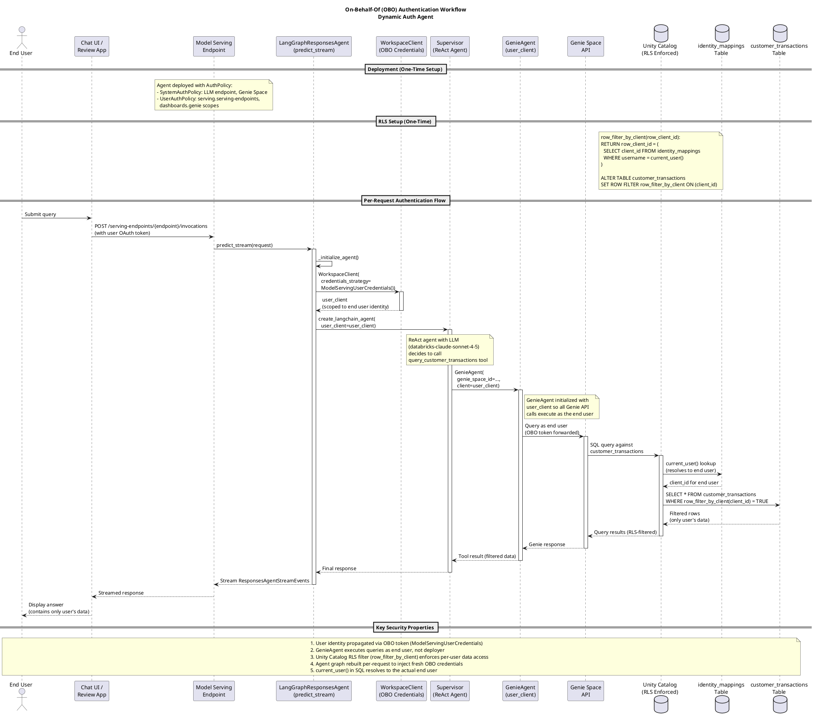

```plantuml
@startuml OBO Authentication Workflow

title On-Behalf-Of (OBO) Authentication Workflow\nDynamic Auth Agent

actor "End User" as User
participant "Chat UI /\nReview App" as UI
participant "Model Serving\nEndpoint" as Serving
participant "LangGraphResponsesAgent\n(predict_stream)" as Agent
participant "WorkspaceClient\n(OBO Credentials)" as OBO
participant "Supervisor\n(ReAct Agent)" as Supervisor
participant "GenieAgent\n(user_client)" as Genie
participant "Genie Space\nAPI" as GenieAPI
database "Unity Catalog\n(RLS Enforced)" as UC
database "identity_mappings\nTable" as IDMap
database "customer_transactions\nTable" as Data

== Deployment (One-Time Setup) ==

note over Serving
  Agent deployed with AuthPolicy:
  - SystemAuthPolicy: LLM endpoint, Genie Space
  - UserAuthPolicy: serving.serving-endpoints,
    dashboards.genie scopes
end note

== RLS Setup (One-Time) ==

note over UC
  row_filter_by_client(row_client_id):
  RETURN row_client_id = (
    SELECT client_id FROM identity_mappings
    WHERE username = current_user()
  )

  ALTER TABLE customer_transactions
  SET ROW FILTER row_filter_by_client ON (client_id)
end note

== Per-Request Authentication Flow ==

User -> UI : Submit query
UI -> Serving : POST /serving-endpoints/{endpoint}/invocations\n(with user OAuth token)

Serving -> Agent : predict_stream(request)
activate Agent

Agent -> Agent : _initialize_agent()
Agent -> OBO : WorkspaceClient(\n  credentials_strategy=\n  ModelServingUserCredentials())
activate OBO
OBO --> Agent : user_client\n(scoped to end user identity)
deactivate OBO

Agent -> Supervisor : create_langchain_agent(\n  user_client=user_client)
activate Supervisor

note over Supervisor
  ReAct agent with LLM
  (databricks-claude-sonnet-4-5)
  decides to call
  query_customer_transactions tool
end note

Supervisor -> Genie : GenieAgent(\n  genie_space_id=...,\n  client=user_client)
activate Genie

note right of Genie
  GenieAgent initialized with
  user_client so all Genie API
  calls execute as the end user
end note

Genie -> GenieAPI : Query as end user\n(OBO token forwarded)
activate GenieAPI

GenieAPI -> UC : SQL query against\ncustomer_transactions
activate UC

UC -> IDMap : current_user() lookup\n(resolves to end user)
IDMap --> UC : client_id for end user

UC -> Data : SELECT * FROM customer_transactions\nWHERE row_filter_by_client(client_id) = TRUE
Data --> UC : Filtered rows\n(only user's data)

UC --> GenieAPI : Query results (RLS-filtered)
deactivate UC

GenieAPI --> Genie : Genie response
deactivate GenieAPI

Genie --> Supervisor : Tool result (filtered data)
deactivate Genie

Supervisor --> Agent : Final response
deactivate Supervisor

Agent --> Serving : Stream ResponsesAgentStreamEvents
deactivate Agent

Serving --> UI : Streamed response
UI --> User : Display answer\n(contains only user's data)

== Key Security Properties ==

note over User, Data
  1. User identity propagated via OBO token (ModelServingUserCredentials)
  2. GenieAgent executes queries as end user, not deployer
  3. Unity Catalog RLS filter (row_filter_by_client) enforces per-user data access
  4. Agent graph rebuilt per-request to inject fresh OBO credentials
  5. current_user() in SQL resolves to the actual end user
end note

@enduml
```
